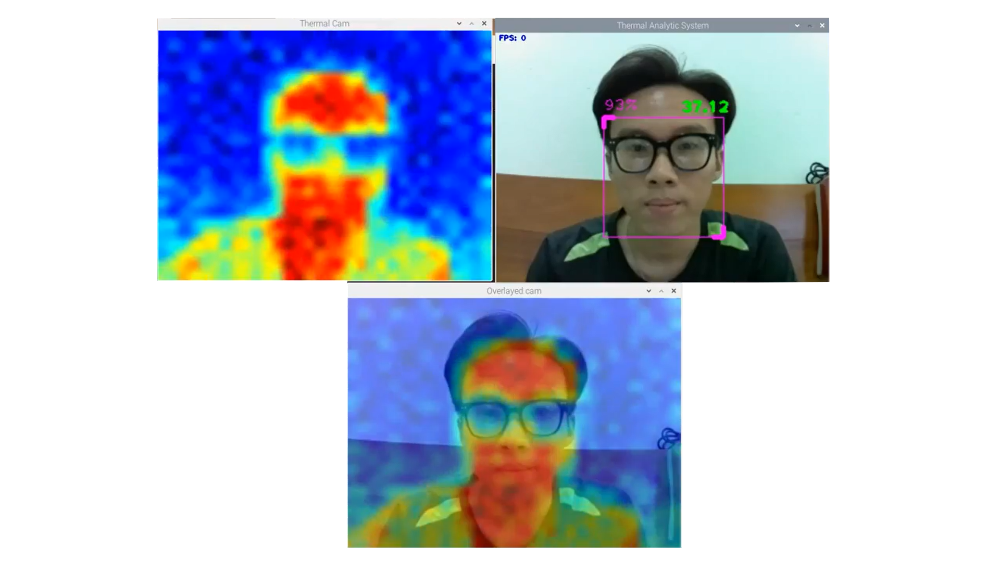

# thermal-and-visible-images-fusion
This is a student project for a module of face detection and temperature calculation.

Objective: To capture images of participants and display them with a calculated facial temperature on a window.

In this file will you find prerequisite on hardwares, middlewares and softwares installation along with their purposes; wiring instructions; explanations on how the module works; some limitations and corresponding approaches.

Let's begin!

## 1. Requirements:

### a/ Hardwares
- MLX90640 module (IR Array Thermal Imaging Camera): To capture thermal image of participants

- Raspberry Pi Camera Module: To capture visible image of participants

- Raspberry Pi 3 Model B: To collect sensor data 

### b/ Middlewares
Install Raspberry Pi OS or Ubuntu 20.04 

### c/ Softwares
Lists of lib used and their main effect on the project:

* OpenCV: https://opencv.org/
* Mediapiipe: https://google.github.io/mediapipe/
* Numpy: https://numpy.org/
* Scipy: https://scipy.org/
* Adafruit_MLX90640: https://github.com/adafruit/Adafruit_MLX90640.git

## 2. Instructions:

- Wiring diagram table (for MLX90640)

- Hardwares mounting

## 3. Operations:

[>>> Code <<<](./code/thermal_visible_fusion.py)

- Face detection module is developed basing on the mediapipe package, and it provides a highly precise result for detected faces with
the rate of detection can be set over 90%.

- The thermal sensor MLX90640 is connected to the Raspberry Pi via I2C. Then, its thermal data array is collected in real-time and fused
with the RGB image captured from the Picam.

- Finally, the algorithm is to consider all thermal data in the bounding box of the detected face, which is in this case I have narrowed down this region into only the forehead of the detected face (~1/3.3 top height of the bounding box), then taking the maximum value of this data
array in this forehead region.

- The result shows a relatively accurate facial temperature with an error of approximately only ± 0.1 to 0.2 °C (provided that the optimal nominal distance for participants: 40-50cm away from the cameras).

## 4. Limitations:

   a) Low fps rate when processing face detection function on RGB image and collecting thermal data from MLX90640 sensor simultaneously due to low performance of the processor Raspberry Pi 3B.

   b) MLX90640 sensor cannot capture accurate temperature when the face is covered by objectives, i.e. glasses, face mask.

## 5. Solution:

   a) Select a specific frame to display instead of real-time displaying (Capture the 11th frame after 10 captured frames). Then, the lagging between displayed image and real-time motion reduces down to only ~4-5 seconds.

   b) Extend bounding box contour and capture only max value of forehead region [~1/3.3 top height of the box] as stated above.

## 6. Proof of concept:

